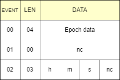

# **Table of contents**
- [**Table of contents**](#table-of-contents)
- [**1. About this project**](#1-about-this-project)
- [**2. System overview**](#2-system-overview)
  - [**2.1. Sequence diagram**](#21-sequence-diagram)
  - [**2.2. State machine diagram receiving UART**](#22-state-machine-diagram-receiving-uart)
  - [**2.3. State machine diagram receiving UART**](#23-state-machine-diagram-receiving-uart)
  - [**2.4. Protocol to communicate with user**](#24-protocol-to-communicate-with-user)

# **1. About this project**
This project aims to convert epoch values received via UART to date and time values and then store them in the RTC DS1307. The system will also allow the input of commands via UART to get the current time and set alarms based on the data from the DS1307.

# **2. System overview**
## **2.1. Sequence diagram**
Below is a sequence diagram demonstrating what system do when user send a command through UART.

## **2.2. State machine diagram receiving UART**
Below is a State machine demonstrating what system uart process data.

## **2.3. State machine diagram receiving UART**
Below is a State machine demonstrating what system manager process data to check alarm.

## **2.4. Protocol to communicate with user**

- **UART_TYPE_SET_TIME**: (0x00)
  - **Len** (1 byte): 0x04
  - **Data** (4 byte): epoch time
- **UART_TYPE_GET_TIME**: (0X01)
  - **Len** (1 byte): 0x00
  - **Data** (0 byte)
- **UART_TYPE_SET_ALARM**: (0x02)
  - **Len** (1 byte): 0x03
  - **Data** (3 byte): hour | min | sec
